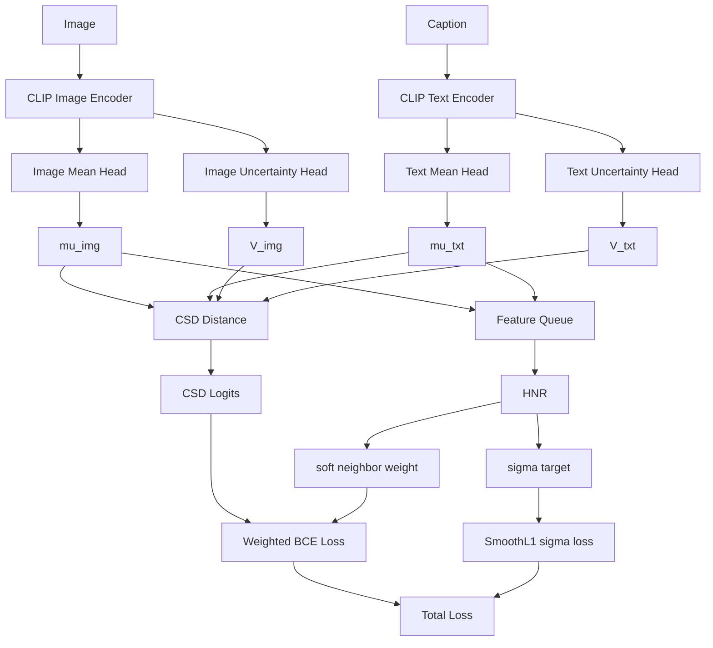

# CSD-HNR Method Design

本文档记录当前 `CSD_HNR` 实验版本的整体方案。该方案基于 PCME++，目标是在不引入额外数据集、不更换更强 backbone 的前提下，解决概率嵌入中 `sigma` 退化的问题，并尝试提升 mAP@R 和 R-Precision。

## 1. 方法目标

原始 PCME++ 使用概率嵌入表示图像和文本：

```text
image -> (mu_img, sigma_img)
text  -> (mu_txt, sigma_txt)
```

其中：

- `mu` 表示语义中心，用于描述样本在语义空间中的位置。
- `sigma` 表示不确定性，用于描述该样本语义是否模糊、泛化或难以唯一匹配。

已有实验中观察到一个问题：`sigma` 虽然平均值没有完全归零，但部分模态，尤其是文本模态，在很多维度上已经接近退化。也就是说，模型可能只用少数维度维持平均方差，大部分维度并没有学到有意义的不确定性。

当前方案的核心目标是：

```text
1. 保留 PCME++ 的 CSD 主相似度，避免 UWSD 改动过大导致 R@1 和排序性能下降。
2. 将 sigma 改成样本级 total variance，减少维度级退化。
3. 使用 HNR 根据语义邻域结构校准 sigma。
4. 对疑似假负样本降低负样本惩罚，但不直接改成硬正样本。
```

## 2. 相关缩写

| 缩写 | 全称 | 含义 |
|---|---|---|
| `mu` | mean embedding | 样本的语义中心向量 |
| `sigma` | standard deviation | 标准差，表示不确定性 |
| `log sigma^2` | log variance | 对数方差，代码中常用的方差输出形式 |
| `V` | total variance | 样本级总方差 |
| `CSD` | Closed-form Sample Distance | PCME++ 中的概率距离 |
| `HNR` | Hubness Neighbor Regularization | 当前实验中设计的邻域不确定性正则模块 |
| `BCE` | Binary Cross Entropy | 二元交叉熵，用于正负图文对匹配 |
| `SmoothL1` | Smooth L1 Loss | 稳定的回归损失，小误差近似 L2，大误差近似 L1 |
| `hubness` | hubness | 一个样本频繁成为很多样本近邻的现象 |

## 3. 整体架构



整体训练由三部分组成：

```text
L_total = L_csd_bce + lambda_sigma * L_hnr_sigma + lambda_neighbor * L_hnr_neighbor
```

其中：

- `L_csd_bce` 是 PCME++ 的主匹配损失。
- `L_hnr_sigma` 用于校准预测不确定性。
- `L_hnr_neighbor` 用于增强 in-batch 的软邻域排序一致性。

## 4. 工程问题与对应解决方案

当前工程不是单纯增加一个 loss，而是围绕三个实际问题展开：

```text
1. sigma 塌缩或退化。
2. COCO 图文检索中的一对多语义关系。
3. mAP@R / R-Precision 对整体语义排序更敏感。
```

### 4.1 解决 sigma 贴底退化

原始 PCME++ 理论上希望 `sigma` 表示样本不确定性。但 CSD 主损失中：

```text
D_CSD(i,j) = semantic_distance(i,j) + V_img_i + V_txt_j
```

较大的 `V` 会增大距离，降低匹配置信度。因此如果只依赖主匹配损失，模型可能倾向于把 `sigma` 压小，出现贴近下限或语义区分不足的问题。

我们曾尝试过一个更强的结构约束：

```text
per-dim sigma -> scalar total variance -> 均匀广播到各维
```

但对基础 PCME++ checkpoint 做小样本逐维方差统计后，没有发现“少数维度撑起总方差”的极端集中现象。因此当前主线不再强制平均分配方差，而是切回原始 PCME++ 的逐维 `log sigma^2`：

```text
feature -> per-dim log sigma^2 in R^D
```

HNR 只约束逐维方差的总量：

```text
V_pred = sum_d exp(log sigma_d^2)
```

这样保留逐维 `sigma` 的表达能力，同时用邻域结构给总不确定性提供语义校准。

### 4.2 给 sigma 一个语义校准依据

如果只靠 CSD 主损失学习 `sigma`，它并不一定会学成我们想要的“语义不确定性”。

原因是 CSD 中：

```text
D_CSD(i,j) = semantic_distance(i,j) + V_img_i + V_txt_j
```

较大的 `V` 会增大距离，降低匹配置信度。因此主损失更倾向于让正样本相关的 `V` 变小，让模型更容易匹配正确 pair。这样 `sigma` 很容易被主任务压低，退化成接近确定性模型。

所以当前工程加入 HNR，给 `sigma` 一个额外的语义依据：

```text
如果一个样本的语义邻域更模糊、更密集，
它应该有更大的 target variance。
```

这不是让 `sigma` 任意变大，而是给它一个可解释的方向：

```text
清晰样本 -> 小 sigma
泛化样本 -> 大 sigma
邻域复杂样本 -> 大 sigma
```

### 4.3 缓解一对多和假负样本

COCO 图文检索不是严格的一对一任务。一个图像有多个 caption，同一个 caption 描述也可能适用于多张相似图片。

例如：

```text
T = "a person standing outside"
```

这个 caption 可能和很多图片语义相关。如果 batch 中 `(I_a, T)` 不是原始标注 pair，普通训练会把它当成负样本：

```text
label(I_a, T) = 0
```

但它可能不是严格负样本，而是未标注的相关样本，也就是假负样本。

如果把所有这种样本都强行推远，会带来两个后果：

```text
1. 语义相关样本被排到后面。
2. mAP@R 和 R-Precision 难以提升。
```

当前工程不直接把疑似假负样本改成正样本，因为硬伪标签风险较高。错误伪正样本一旦被拉近，会污染后续训练。

因此采用更保守的软权重策略：

```text
疑似假负样本仍然 label = 0
但 BCE weight 从 1.0 降低到 0.2 ~ 1.0
```

含义是：

```text
我不确定它是不是正样本，
但我不希望模型强行把它推远。
```

这是一种假负样本缓解机制，而不是伪标签机制。

### 4.4 面向 mAP@R / R-Precision 的排序目标

R@1 主要关注：

```text
第一个正确匹配是否排在最前。
```

mAP@R 和 R-Precision 更关注：

```text
多个相关样本在前 R 个位置中的整体排序质量。
```

所以只优化标注配对的强匹配，不一定能提升 mAP@R / R-Precision。模型还需要避免把语义相关但未标注的样本当成强负样本推远。

HNR 的 soft neighbor weight 正是为这个目标服务：

```text
减少对潜在语义邻居的过度惩罚，
让语义相关样本有机会保持在更靠前的位置。
```

## 5. Sigma 建模线

### 5.1 当前主线：原始逐维 sigma

当前主线使用原始 PCME++ 的逐维不确定性分支，不再强制平均分配方差：

```text
feature -> std branch -> per-dim log sigma^2 in R^D
```

图像和文本分别得到：

```text
image_i -> log sigma_img_i^2 in R^D
text_j  -> log sigma_txt_j^2 in R^D
```

这保留了逐维表达能力。也就是说，模型仍然可以表达某个样本在不同语义方向上的不确定性差异，而不是所有维度共用同一个方差值。

### 5.2 总方差用于 CSD 和 HNR

虽然模型输出逐维 `log sigma^2`，但 CSD 和 HNR 关心的是总方差：

```text
V_pred = sum_d exp(log sigma_d^2)
```

在代码中等价写法是：

```text
log V_pred = logsumexp(log sigma^2, dim=-1)
V_pred = exp(log V_pred)
```

因此当前方案是：

```text
逐维 sigma 负责表达能力；
总方差 V_pred 负责参与 CSD 和 HNR 校准。
```

### 5.3 HNR 如何校准总方差

HNR 根据 feature queue 估计样本的跨模态中心性：

```text
centrality_img = mean(cosine(mu_img, text_queue))
centrality_txt = mean(cosine(mu_txt, image_queue))
```

然后用 EMA 均值/方差进行标准化：

```text
z = (centrality - EMA_mean) / sqrt(EMA_var)
```

再映射成目标总方差：

```text
V_target = V_min + (V_max - V_min) * sigmoid(z / temperature)
```

当前 HNR 目标范围：

```text
V_min = 0.01
V_max = 0.30
```

最后用 SmoothL1 校准：

```text
L_hnr_sigma = SmoothL1(log V_pred, log V_target)
```

注意，这里只约束总量：

```text
sum_d exp(log sigma_d^2)
```

不强制每个维度都相等。

### 5.4 scalar total variance 作为 ablation

工程里仍保留 `ScalarTotalVarianceHead`，但当前配置关闭：

```text
scalar_total_variance: false
```

它只作为 ablation 方案存在。该方案流程是：

```text
feature -> raw -> sigmoid -> scalar V -> V / D -> broadcast log sigma^2
```

基础 PCME++ checkpoint 的小样本统计没有发现逐维方差极端集中，因此主线不再使用这个平均分配方案。

## 6. CSD 主匹配线

当前方案保留 PCME++ 的 CSD 主相似度。对于图像 `I_i` 和文本 `T_j`：

```text
D_CSD(i,j) = 2 - 2 * cosine(mu_img_i, mu_txt_j) + V_img_i + V_txt_j
```

距离越小，表示匹配越可靠。代码中再通过可学习的 `shift` 和 `negative_scale` 将距离转换成 logits：

```text
logit(i,j) = shift - negative_scale * D_CSD(i,j)
```

然后使用 BCE 监督图文匹配：

```text
L_csd_bce = BCEWithLogits(logit, label)
```

其中：

```text
label(i,j) = 1  表示标注正样本
label(i,j) = 0  表示 batch 内未标注配对
```

需要注意：在 CSD 中，较大的 `V` 会增加距离。因此 `sigma` 不是“越大越匹配”，而是表示该样本更不确定，匹配置信度更低。

## 7. HNR 模块

### 7.1 为什么需要 HNR

mAP@R 和 R-Precision 与普通 R@1 不完全相同。R@1 更关心第一个正确样本是否排在最前；mAP@R 和 R-Precision 更关心语义相关样本在检索列表中的整体排序。

COCO 中存在大量未标注但语义相关的图文对。如果训练时把所有未标注 pair 都当作强负样本，模型会把潜在相关样本推远，从而影响 mAP@R 和 R-Precision。

HNR 的目的不是直接制造伪正样本，而是更保守地做两件事：

```text
1. 根据邻域结构给样本生成 sigma target。
2. 对疑似假负样本降低负样本惩罚权重。
```

### 7.2 Feature queue

HNR 不做全局检索，也不记录每个 pair 的历史状态。它只维护最近若干 batch 的 detached feature queue：

```text
image queue: 最近若干图像 mu
text queue:  最近若干文本 mu
```

当前默认队列大小：

```text
queue_size = 8192
```

这里的 `detached` 表示队列中的特征不参与梯度回传，只作为当前 batch 的邻域参考。

使用 queue 的原因是：

```text
1. 全局检索内存和计算开销过大。
2. batch 内样本太少，邻域估计不稳定。
3. 最近特征队列能提供一个折中近似。
```

### 7.3 Hubness centrality

对于一个图像样本，HNR 会计算它与 text queue 中样本的平均相似度：

```text
centrality_img = mean(cosine(mu_img, text_queue))
```

对于一个文本样本，计算它与 image queue 中样本的平均相似度：

```text
centrality_txt = mean(cosine(mu_txt, image_queue))
```

如果一个样本和很多异模态样本都相似，说明它处在语义空间中较模糊或较中心的位置，例如：

```text
"a person outside"
"a dog on grass"
"a man standing near a street"
```

这些样本可能天然对应多个相似图像，因此应该具有较高不确定性。

如果一个样本非常具体，例如：

```text
"a yellow school bus parked beside a red fire hydrant"
```

它周围高相似样本较少，因此目标不确定性应该较低。

### 7.4 Sigma target

HNR 会将 `centrality` 标准化，然后映射成目标方差：

```text
centrality high -> V_target high
centrality low  -> V_target low
```

目标方差同样被限制在：

```text
[V_min, V_max]
```

然后使用 SmoothL1 监督预测方差：

```text
L_hnr_sigma = SmoothL1(log(V_pred), log(V_target))
```

这里使用 `log(V)` 而不是直接使用 `V`，是为了让损失更关注比例误差。例如：

```text
0.02 -> 0.04
0.10 -> 0.20
```

两者在比例上都是翻倍，用 log 空间会更公平。

### 7.5 Soft neighbor weight

HNR 还会在当前 batch 内寻找疑似语义邻居。

对于一个未标注 pair `(I_i, T_j)`，如果满足：

```text
1. I_i 和 T_j 的直接相似度较高。
2. 同模态邻域关系也支持这个 pair。
3. 该 pair 不是孤立的偶然高分。
```

则它可能是未标注的相关样本，也就是假负样本。

当前方案不会将它直接改成正样本：

```text
label = 0 -> label = 1
```

而是降低它作为负样本时的惩罚权重：

```text
label = 0
weight = 1.0 -> weight = 0.2 ~ 1.0
```

例如：

```text
原始训练：
label(I_1, T_3) = 0
weight(I_1, T_3) = 1.0

HNR 后：
label(I_1, T_3) = 0
weight(I_1, T_3) = 0.4
```

含义是：

```text
这个 pair 仍然不是标注正样本，但它可能语义相关，所以不要强行推远。
```

这比硬伪标签更稳，因为错误伪正样本会直接污染排序学习，而 soft weight 只是降低惩罚强度。

## 8. 工程数据流

从一次训练 step 看，当前工程的数据流如下：

```text
1. dataloader 读取一个 batch 的图像和 caption。
2. 图像进入 CLIP image encoder，文本进入 CLIP text encoder。
3. mean head 输出 mu_img 和 mu_txt。
4. scalar variance head 输出 V_img 和 V_txt。
5. 将 V 转换为兼容 PCME++ 的 log sigma^2。
6. CSD 使用 mu 和 V 计算图文距离矩阵。
7. CSD 距离被转换为 logits。
8. HNR 使用 detached mu 和 feature queue 计算邻域结构。
9. HNR 生成 sigma target，得到 L_hnr_sigma。
10. HNR 识别 batch 内疑似假负 pair，生成 pair weight。
11. Weighted BCE 使用 pair weight 计算主匹配损失。
12. 总损失反向传播，更新 CLIP adapter/head、mean head、variance head 等可训练参数。
13. 当前 batch 的 detached mu 被写入 feature queue，供后续 batch 使用。
```

这里有两个关键梯度边界：

```text
1. feature queue 中的特征 detached，不反向传播。
2. HNR 生成 sigma target 时使用的邻域统计不直接更新 mu，只监督 variance head。
```

这样设计的原因是：HNR 的邻域估计本身存在噪声，如果让它直接强力改变语义中心 `mu`，容易破坏主检索空间。当前版本让 `mu` 主要由 CSD 主损失学习，HNR 主要负责校准 `sigma` 和调节负样本惩罚。

## 9. 训练阶段

HNR 不建议从第一个 epoch 就强力启动。原因是早期 `mu` 空间还不稳定，邻域结构噪声较大。

当前默认：

```text
start_epoch = 5
warmup_epochs = 5
```

含义是：

```text
epoch 0 ~ 4: 只使用 CSD 主匹配损失，HNR 不启动。
epoch 5 ~ 9: HNR 逐渐增大权重。
epoch 10 以后: HNR 使用完整权重。
```

这样可以避免早期错误邻域结构过度影响 sigma 和负样本权重。

## 10. 关键参数

| 参数 | 作用 | 默认值 | 调节方向 |
|---|---|---:|---|
| `model.scalar_total_variance` | 是否启用标量平均方差 ablation | `false` | 当前主线保持关闭，使用原始逐维 sigma |
| `hubness_neighbor.total_var_min` | HNR 目标总方差下限 | `0.01` | 过低可能退化，过高可能伤 R@1 |
| `hubness_neighbor.total_var_max` | HNR 目标总方差上限 | `0.30` | 过低 sigma 影响弱，过高可能干扰 mu 排序 |
| `hubness_neighbor.enable` | 是否启用 HNR | `true` | 当前方案应保持开启 |
| `hubness_neighbor.start_epoch` | HNR 启动 epoch | `5` | 早启动风险高，晚启动影响弱 |
| `hubness_neighbor.warmup_epochs` | HNR 权重 warmup 长度 | `5` | 用于平滑启动 |
| `hubness_neighbor.lambda_sigma` | sigma 校准损失权重 | `0.01` | sigma 不动可增大，过强会伤主任务 |
| `hubness_neighbor.lambda_neighbor` | 邻域软排序损失权重 | `0.05` | mAP/R-P 不动可适度增大 |
| `hubness_neighbor.rho` | soft neighbor 混合比例 | `0.10` | 越大越激进 |
| `hubness_neighbor.topk` | batch 内候选邻居数量 | `20` | 大 batch 可适度增大 |
| `hubness_neighbor.negative_min_weight` | 疑似假负样本最低负权重 | `0.20` | 越低越不惩罚疑似假负 |

## 11. 推荐观察指标

训练时不要只看 loss。该方案至少要同时观察：

```text
1. mAP@R
2. R-Precision
3. COCO 1K R@1
4. COCO 5K R@1
5. image total variance mean
6. text total variance mean
7. sigma 是否大量贴近 V_min 或 V_max
8. sigma 与检索难度的相关性
```

判断标准：

```text
mAP@R > 40.2
R-Precision > 49.7
COCO 5K R@1 接近或高于 55.5
sigma 与检索难度保持合理相关性
```

如果 mAP@R / R-Precision 没有提升，但 sigma 分布变合理，说明 sigma 校准有效，但 soft neighbor 对排序帮助不够。下一步应优先调：

```text
rho
lambda_neighbor
topk
negative_min_weight
direct threshold
same-modal threshold
```

如果 sigma 仍然贴近下限，说明：

```text
lambda_sigma 太弱，或 V_min/V_max 范围不合适，或 HNR target 对样本难度区分不够。
```

如果 COCO 5K R@1 明显下降，说明：

```text
soft neighbor 或 variance range 太激进，sigma 开始干扰 mu 的精确匹配排序。
```

## 12. 代码位置

当前方案主要实现位置：

| 文件 | 作用 |
|---|---|
| `pcmepp/models/uncertainty.py` | scalar total variance ablation head，当前主线不启用 |
| `pcmepp/models/img_encoder.py` | 图像概率嵌入输出 |
| `pcmepp/models/txt_encoder.py` | 文本概率嵌入输出 |
| `pcmepp/hubness_neighbor.py` | HNR 主模块 |
| `pcmepp/criterions/pcmepp.py` | 支持 pair weight 的 CSD BCE |
| `pcmepp/engine.py` | 训练时接入 HNR 和加权损失 |
| `configs/pcmepp.yaml` | 当前实验配置 |

## 13. 当前方案与硬伪标签方案的区别

硬伪标签方案会把高相似未标注 pair 直接改成正样本：

```text
label = 0 -> label = 1
```

这种方法对 mAP@R / R-Precision 可能有帮助，但风险较高。错误伪正样本一旦进入训练，会被持续拉近，造成错误强化。

当前 CSD-HNR 方案更保守：

```text
1. 不记录 accepted / unknown 状态。
2. 不做全局检索。
3. 不把未标注 pair 直接改成正样本。
4. 只降低疑似假负样本的负样本惩罚。
5. 用邻域结构校准样本级 sigma。
```

因此它的风险更低，适合作为当前阶段的第一版实验。如果该方法能稳定改善 sigma，但 mAP@R / R-Precision 提升有限，再考虑更强的软标签或伪标签机制。

## 14. 一个完整例子

假设有两个 caption：

```text
T1 = "a red bus parked beside a tree"
T2 = "a person outside"
```

T1 更具体，HNR 发现它周围相似样本较少：

```text
V_target(T1) = 0.04
```

T2 更泛化，HNR 发现它与很多图像都相似：

```text
V_target(T2) = 0.22
```

variance head 输出：

```text
V_pred(T1) = 0.045
V_pred(T2) = 0.216
```

这说明模型已经学到：

```text
具体文本 -> 低 sigma
泛化文本 -> 高 sigma
```

如果当前 batch 中存在一个未标注 pair：

```text
(I_3, T2)
```

它不是原始标注正样本，但直接相似度和邻域证据都较高。原始 BCE 会把它作为强负样本：

```text
label = 0
weight = 1.0
```

HNR 会改成：

```text
label = 0
weight = 0.4
```

模型不会把它当正样本强行拉近，但也不会强行推远。这个设计的目的，是减少假负样本对语义排序的破坏，从而更有利于 mAP@R 和 R-Precision。
